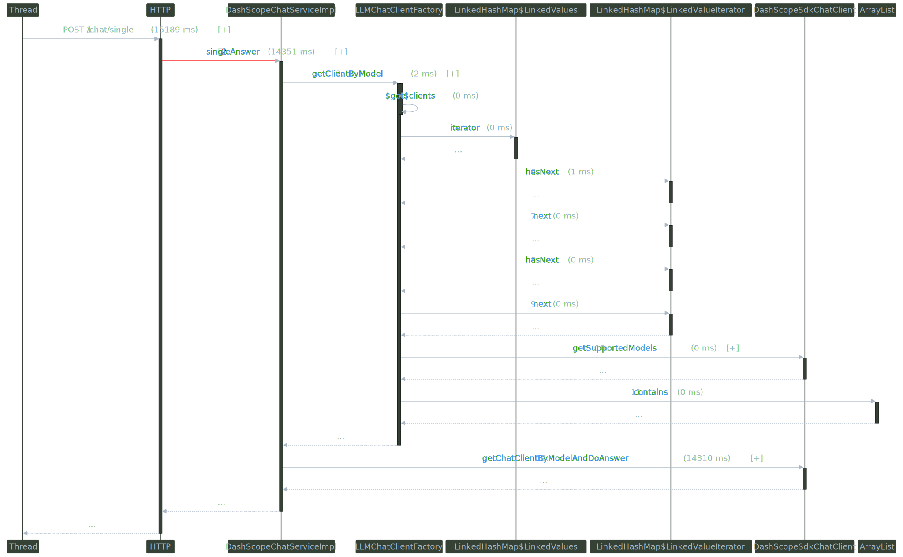

# magic-gate Ai脚手架系统设计说明
> 项目整体用于搭建Agent智能体平台,主要完成以下两个目标:</br>
>   1.在项目内进行知识库Agent的智能体的实现</br>
>>      a.可以通过Spring Ai + Spring Ai Alibaba 的方式使用代码逻辑交互自定义构建具备特殊能力的智能体
>>      b.通过调用百炼API的方式实现云端智能体的调用。</br>
>   2.实现知识库的知识管理</br>
>>       a.通过百炼知识库进行知识库管理,通过百炼官方API实现知识库云端管理</br>
>>       b.自部署其他相关向量数据库,结合关系型数据库，实现向量数据的自主管理</br>

## 写在最前
> <font color="red">代码实现中也有大量的注释说明,对于调用参数进行详细解释,或详细说明可以如何实现,请留意关注这些信息</font>

## 关键依赖版本管理
> <font color="red">调整关键依赖版本的时候,请参照官方文档的版本管理进行配置,随意更换版本后可能会引发依赖冲突</font></br>
> 相关文档链接：</br>
>   1.[Spring Ai Alibaba](https://java2ai.com/?spm=4347728f.53ae79f1.0.0.6bd6362btbu3eW)</br>
>   2.[Spring Ai](https://docs.spring.io/spring-ai/reference/1.1-SNAPSHOT/index.html)</br>

| 依赖名称                                | 版本号     |
|-------------------------------------|---------|
| spring-ai-alibaba                   | 1.0.0.2 |
| spring-ai                           | 1.0.0-M6 |
| spring-boot                         | 3.4.5   |


## 目录结构以及关键类说明

### magicgate-common
> 该模块用于管理一些外部可能会用到的公共数据，以及提供项目内共用的工具类等内容
```text
magicgate-common/
├── src/
│   ├── main/
│   │   ├── java/
│   │   │   ├── com/
│   │   │       ├── magicgate/
│   │   │           ├── common/
│   │   │               ├── request/
│   │   │               │   ├── DialogueHistoryRequest.java                     //对话历史数据
│   │   │               │   └── DialogueRequest.java                            //对话入参，这里提取了LLM的相关配置，用于调试，也可以移除使用配置方案锁定
│   │   │               ├── utils/
│   │   │                   ├── BeanCopyUtils.java                              //BeanUtils增强
│   │   │                   └── JobManager.java                                 //临时职责管理类，用来管理prompt提示词,可以使用百炼或者Nacos管理替代
│   │   ├── resources/
│   │       ├── META-INF/
│   │           └── spring.factories                                            //用于注入配置项
│   ├── test/
│       ├── java/
└── pom.xml
```

### magicgate-link
> 该模块用于实际的AI调用入口，以及AI交互时的具体业务逻辑实现
```text
magicgate-link/
├── src/
│   ├── main/
│   │   ├── java/
│   │   │   ├── com/
│   │   │       ├── magicgate/
│   │   │           ├── link/
│   │   │               ├── controller/
│   │   │               │   └── DashScopeChatController.java
│   │   │               ├── domain/
│   │   │               │   ├── advisor/
│   │   │               │   │   └── SafeGuardAdvisor.java                                           //敏感词增强器，用于对大模型的输入输出做一次过滤
│   │   │               │   ├── client/
│   │   │               │   │   ├── customized/
│   │   │               │   │   │   ├── DashScopeOpenAiChatClient.java                              //通过实现Spring的抽象对话客户端实现LLM调用，OpenAI等其他模型可以参照此客户端方法实现 
│   │   │               │   │   │   └── DashScopeSdkChatClient.java                                 //通过DashScope SDK的方式去实现对话调用
│   │   │               │   │   ├── AbstractLLMChatClient.java                                      //项目的客户端抽象类，用于管理所有的对话客户端，以便于在配置多模型的时候通过模型名称选取适合的客户端
│   │   │               │   │   ├── LLMChatClientFactory.java                                       //抽象工厂，可以使用他获取到想要的客户端，而无须多次注入
│   │   │               │   │   └── LLMProviderProperties.java                                      //自定义的配置类，用于管理不同的大模型的调用基本配置参数，config-prefix:llm
│   │   │               │   ├── dto/                                                                //数据模型存储-与数据库交互
│   │   │               │   ├── model/                                                              //领域模型存储-不与数据库交互
│   │   │               │   ├── process/
│   │   │               │       ├── impl/
│   │   │               │       │   ├── DialogueProcessImpl.java           
│   │   │               │       │   └── KnowledgeBaseProcessImpl.java
│   │   │               │       ├── DialogueProcess.java                                            //领域业务处理
│   │   │               │       └── KnowledgeBaseProcess.java                                       //知识库相关的领域业务处理 
│   │   │               ├── exception/
│   │   │               │   └── LLMChatException.java                                               //公共自定义大模型异常，大模型客户端交互异常统一使用这个异常返回
│   │   │               ├── handler/
│   │   │               │   └── GlobalExceptionHandler.java                                         //统一异常捕获 
│   │   │               ├── infrastructure/                                                         //基础设施的封装 -- 数据库交互，外部调用
│   │   │               │   ├── integration/                                                        //用于调用外部的接口
│   │   │               │   │   ├── impl/
│   │   │               │   │   │   └── RAGClientImpl.java
│   │   │               │   │   └── RAGClient.java
│   │   │               │   ├── repository/                                                         //数据库交互
│   │   │               │   ├── schedule/                                                           //计划定时任务提交以及MQ调用等 
│   │   │               ├── service/                                                                //MagicLink的自有实际业务实现
│   │   │               │   ├── impl/
│   │   │               │   │   └── DashScopeChatServiceImpl.java
│   │   │               │   └── DashScopeChatService.java
│   │   │               ├── utils/
│   │   │               │   └── FluxUtils.java                                                      //流式返回的处理工具 
│   │   │               └── MagicGateLinkApplication.java
│   │   ├── resources/
│   │       ├── job/                                                                                //用于存放prompt提示词,后缀自定义为".job"
│   │       │   └── AiTeacher.job
│   │       └── application.yml
└── pom.xml
```
### magicgate-rag[待完善]
> 该项目规划用于后期管理百炼知识库,通过实现调用百炼API的方式,与百炼平台的知识库进行交互，LINK服务可通过调用此服务获取相对应的实际知识库，并且可以在该项目中定义实际存储逻辑，或可在本地留存一份百炼知识库的备份或关联信息


## 调用链路图解（magicgate-link）
